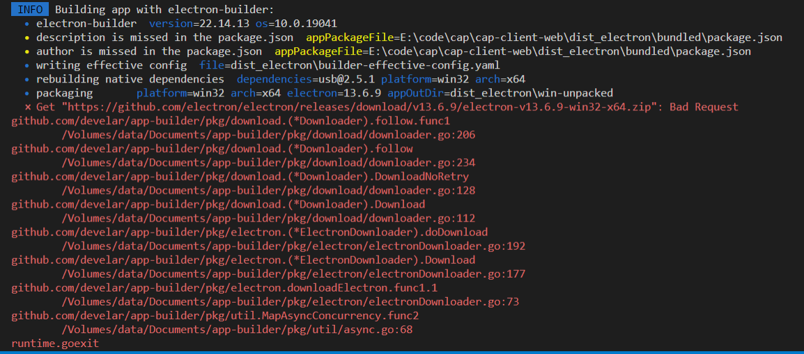
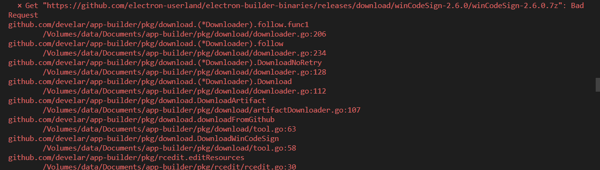
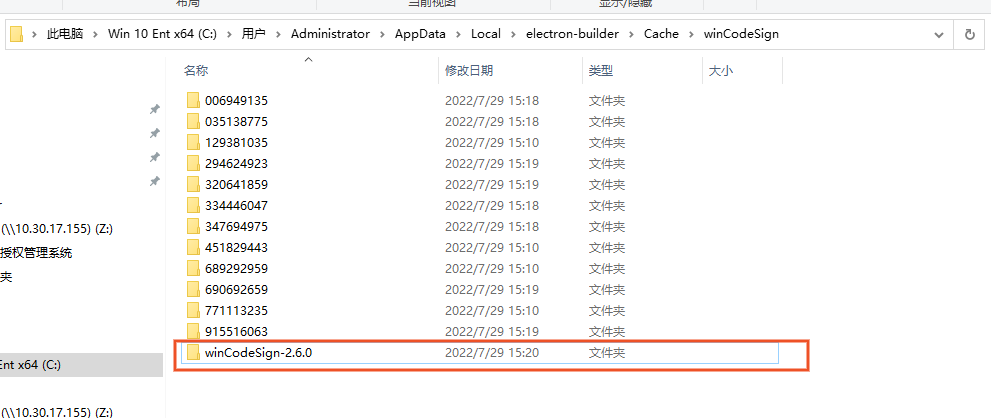
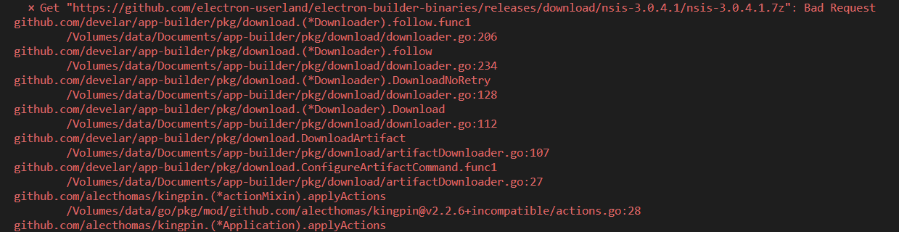
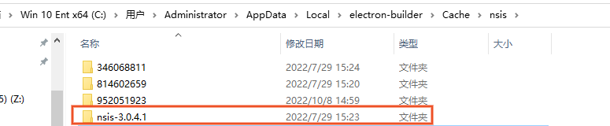
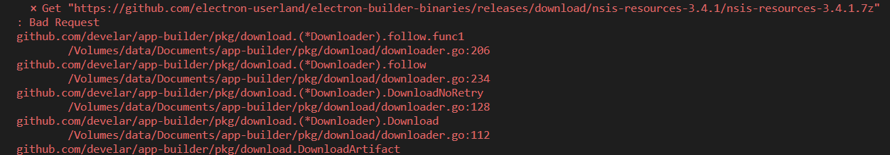
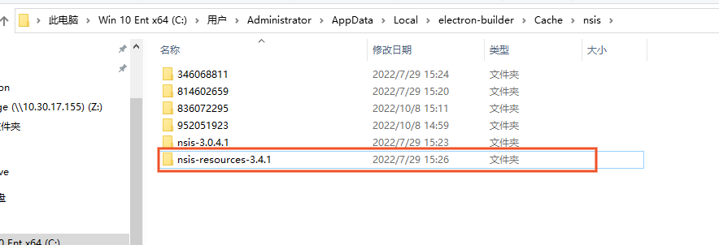
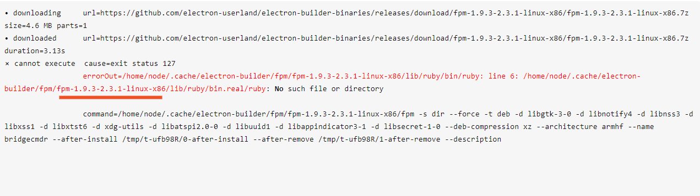

# electron 打包遇到的问题

## 一、网络下载失败

electron 打包过程中，由于网络原因（我是内网开发），下载 github 上的包出错，主要有以下包：

### 1.electron-v13.6.9-win32-x64.zip



### 解决方案：

https://github.com/electron/electron/releases/download/v13.6.9/electron-v13.6.9-win32-x64.zip

离线下载 electron-v13.6.9-win32-x64.zip，再放到对应目录下:

```
windows:C:\Users\Administrator\AppData\Local\electron\Cache
Linux:~/.cache/electron
macOS:~/Library/Caches/electron
```

如图：


### 2.winCodeSign-2.6.0.7z



### 解决方案：

https://github.com/electron-userland/electron-builder-binaries/releases/download/winCodeSign-2.6.0/winCodeSign-2.6.0.7z

离线下载 winCodeSign-2.6.0.7z，再放到对应目录下:

```
windows:C:\Users\Administrator\AppData\Local\electron-builder\Cache
```

如图：


### 3.nsis-3.0.4.1.7z



### 解决方案：

https://github.com/electron-userland/electron-builder-binaries/releases/download/nsis-3.0.4.1/nsis-3.0.4.1.7z

离线下载 nsis-3.0.4.1.7z，再放到对应目录下:

```
windows:C:\Users\Administrator\AppData\Local\electron-builder\Cache\nsis
```

如图：


### 4.nsis-resources-3.4.1.7z



### 解决方案：

https://github.com/electron-userland/electron-builder-binaries/releases/download/nsis-resources-3.4.1/nsis-resources-3.4.1.7z

离线下载 nsis-resources-3.4.1.7z，再放到对应目录下:

```
windows:C:\Users\Administrator\AppData\Local\electron-builder\Cache\nsis
```

如图：


再次打包，成功了！！！

## 二、国产操作系统（通信 UOS arm64 版）

打包流程参考：[linux 打包](https://www.cnblogs.com/tuyile006/p/16399745.html)

### 1. arm64 适配:

安装完 node.js、vscode 等必要的开发环境后，在通信 UOS arm64 位下打包 electron 项目依然会报错


从报错信息可以看到，electron 在 linux 下使用 fpm 进行打包，然而下载的是 x86 的包，而不是 arm64 架构的包

#### 解决方案：

在 x86 上交叉编译出 arm64 的包，重新打包一下成功了！！！

内网开发真的太痛苦了 😭😭😭
