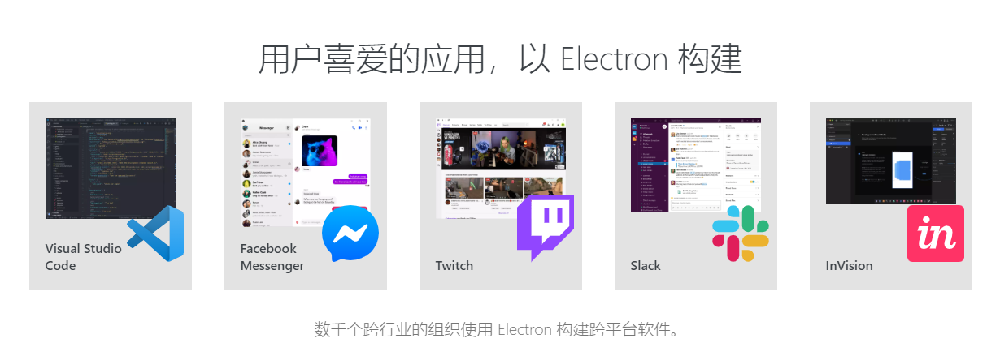
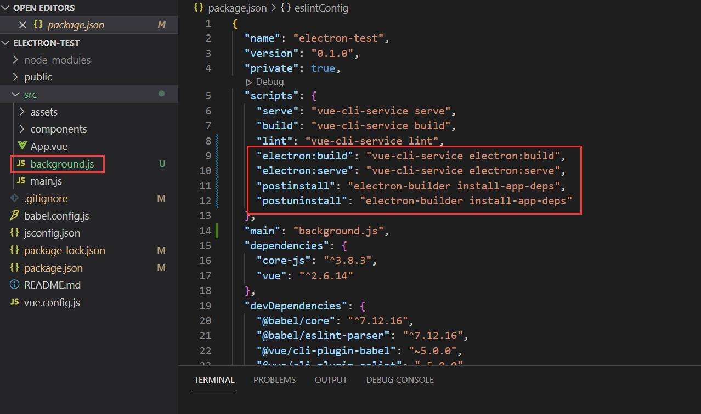

# 一、electron介绍
*官网(https://www.electronjs.org/)*

使用 JavaScript，HTML 和 CSS 构建跨平台的桌面应用程序，通过将Chromium和Node.js合并到同一个运行环境中，兼容Mac、Windows和Linux，可以构建出三个平台的应用程序。



## 二、优势
- 大大降低了开发桌面应用的门槛
- 跨平台 可以打包成Mac、Windows 和 Linux三个平台的应用程序
- Chromium作为内核，无需考虑兼容性，一套代码兼容多个平台

## 三、需要用到的前端技术
- Html、CSS、JavaScript、ES6
- 前端开发工具Vue、Angular、React等的一种
- 进阶使用可能还需要node.js

## 四、项目搭建
1.使用vue-cli创建vue项目
```
vue create electron-test
```
2.安装插件 vue-cli-plugin-electron-builder
```
vue add electron-builder
```
安装完项目结构新增了以下内容：

其中background.js为electron主进程相关操作

五、自定义打包命令
package.json新增以下打包命令，文档参考：https://www.electron.build/cli
```
"electron:build-linux-arm64": "vue-cli-service electron:build --linux --arm64 -p never",
"electron:build-linux-x64": "vue-cli-service electron:build --linux --x64 -p never",
"electron:build-win64": "vue-cli-service electron:build --win --x64 -p never",
"electron:build-win32": "vue-cli-service electron:build --win --ia32 -p never",
```
注意：linux安装包需要在linux系统上编译，另外linux arm64系统的安装包在arm64上编译会报错，需要在linux x64上交叉编译


