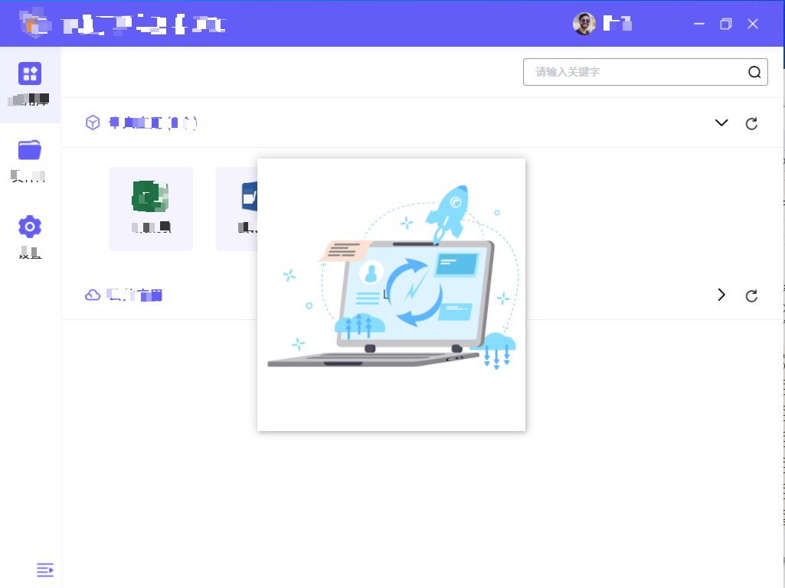

# electron 显示多个窗口

主进程：

```
import { app, BrowserWindow, ipcMain, Notification } from 'electron'

let win
let loadingWin
function createWindow() {
  win = new BrowserWindow({
    width: 1024,
    height: 768
  })
  // 加载另一个窗口
  loadingWin = new BrowserWindow({
    width: 350,
    height: 356,
    show: false
  })
  if (process.env.WEBPACK_DEV_SERVER_URL) { // 开发环境
    await win.loadURL(process.env.WEBPACK_DEV_SERVER_URL)
    await loadingWin.loadURL(process.env.WEBPACK_DEV_SERVER_URL + '#/loading')
    if (!process.env.IS_TEST) win.webContents.openDevTools()
  } else {
    createProtocol('app')
    win.loadURL('app://./index.html')
    loadingWin.loadURL('app://./index.html#/loading') // 加载窗口展示的页面
  }
}
// 打开或关闭loading窗口
ipcMain.on('loading-window', async (event, arg) => {
  if (arg === 'open') loadingWin.show()
  else if (arg === 'close') loadingWin.hide()
})
```



🚀
