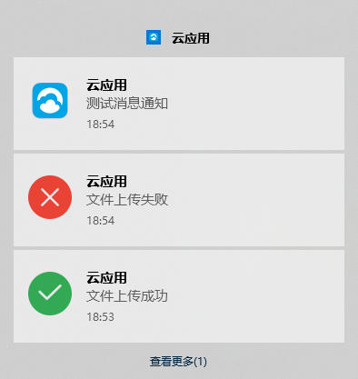

# electron 消息通知

### electron 提供 API 对操作系统发桌面通知，消息的位置和样式保留各自系统原生的样式

注意：消息展示必须确保系统设置允许接收通知消息

主进程（background.js）：

```
import { app, BrowserWindow, ipcMain, Notification } from 'electron'

// 消息通知
ipcMain.on('show-notification', (event, arg) => {
  const notifyObj = new Notification({
    title: arg.title,
    body: arg.detail,
    icon: path.join(__static, arg.icon || 'icons/cloud_client.png') // __static指向public文件夹
  })
  notifyObj.show()
})
```

渲染进程：

```
import { ipcRenderer } from 'electron'
export default{
  mounted() {
    sendMessage() {
      ipcRenderer.send('show-notification', {
        title: '云应用',
        detail: '文件传输成功',
        icon: 'icons/success.png'
      })
    }
  }
}
```



🤔 以上是最简单的使用案例，其他参数请移步[官网](https://www.electronjs.org/zh/docs/latest/api/notification)查看详细信息

`^_^`有问题欢迎指出...
