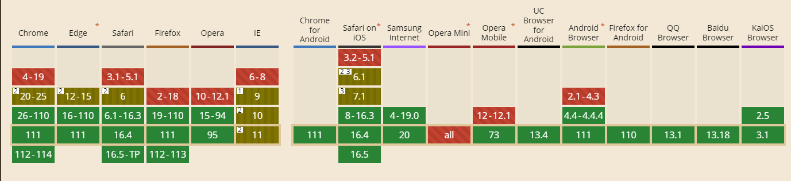

# 移动端适配：

在做移动端开发时，为了使移动端的页面在不同的手机上以同样的大小来显示，我们可以将页面的宽度固定，然后获取设备的宽度，可以得到我们之前设定的宽度与设备宽度的比例，再使用 HTML5 新增的 viewport 来对页面进行缩放，并固定不允许用户再重新缩放。

在 index.html 增加该配置

```
<meta
  name="viewport"
  content="width=device-width, initial-scale=1.0, minimum-scale=1.0, maximum-scale=1.0, user-scalable=no,viewport-fit=cover"
>
```

## rem 适配(淘宝和百度方案)

计算公式：
根字体 = （设备视口宽度 \* 100） / 设计稿宽度

```
<script>
// 获取布局视口宽度
const dpWidth = document.documentElement.clientWidth
// 计算根字体大小
const rootFontSize = (dpWidth * 100) / 375
// 设置根字体大小
document.documentElement.style.fontSize = rootFontSize + 'px'
</script>
```

设置完根字体大小后，后续所有页面都以 rem 为单位，值为 设计稿的像素值/100，例如 14px = 0.14rem，这样在不用设备上都是 0.14rem,但不同设备的 rem 代表的像素值不同，从而实现适配

## vw 适配

它的特点很明显，没有 js 代码，但是兼容性却不好


vw:把布局视口分成 100 份，1vw = 1% 的布局视口 = 1% 的视觉视口
vh:就是 1%的视口高度
用 less 计算

```
@basic: 375 / 100vw;
*{
  margin: 0;
  padding: 0;
}
.demo{
  width: (100/@basic);
  height: (100/@basic);
  background-color: black;
}
```
